# SIGNUM — Neural Signature Forensics

A multi-modal (static image **+** dynamic stroke) forensic signature verification
system: region localization → preprocessing → Siamese CNN + Transformer/LSTM
branches → cross-attention fusion → anomaly scoring → forensic calibration →
explainable, audit-logged verification reports — plus **SIGNUM**, a real-time
cyber-themed web console for it.

[](LICENSE)
[](https://github.com/Uttpal-Tripathy/signature-verification-system/actions/workflows/ci.yml)

> **Read this before quoting an accuracy number from this repo.** Every measured
> result is in [`docs/results.md`](docs/results.md), reported as **skilled-forgery
> accuracy** (hard, realistic) separately from **random-forgery accuracy** (easy,
> commonly used to inflate claims) — with the exact writer count / epoch count /
> dataset behind each number. Nothing here is asserted without a notebook or
> script run backing it.

## Contents

- [What's implemented](#whats-implemented)
- [Architecture](#architecture)
- [The SIGNUM web console](#the-signum-web-console)
- [Installation](#installation)
- [Quickstart](#quickstart)
- [Notebooks — train and test on real data](#notebooks--train-and-test-on-real-data)
- [Results](#results)
- [Research / patent-support documentation](#research--patent-support-documentation)
- [Project layout](#project-layout)
- [Testing](#testing)
- [License](#license)

## What's implemented

| Stage | Approach | Code |
|---|---|---|
| Region localization | YOLOv8 (Ultralytics), full-frame fallback | [`src/sigverify/localization/`](src/sigverify/localization/) |
| Preprocessing | Denoise → deskew → binarize → normalize (image); resample → z-score/min-max (stroke) | [`src/sigverify/preprocessing/`](src/sigverify/preprocessing/) |
| Static verification | Siamese CNN (ResNet50 / EfficientNet-B0 / MobileNetV3), contrastive + triplet loss | [`static_branch.py`](src/sigverify/models/static_branch.py) |
| Dynamic verification | LSTM / GRU / Transformer encoder with attention pooling | [`dynamic_branch.py`](src/sigverify/models/dynamic_branch.py) |
| Fusion | Cross-attention + reliability-gated residual combination, graceful single-modality fallback | [`fusion.py`](src/sigverify/models/fusion.py) |
| Forgery augmentation | CycleGAN + closed-loop failure-case mining | [`gan_forgery.py`](src/sigverify/models/gan_forgery.py) |
| Anomaly detection | One-Class SVM / Isolation Forest (per-writer) | [`anomaly.py`](src/sigverify/models/anomaly.py) |
| Calibration | Platt scaling / Score-based Likelihood Ratio | [`calibration.py`](src/sigverify/models/calibration.py) |
| Explainability | Grad-CAM (static), attention + DTW deviation (dynamic), SHAP modality split | [`src/sigverify/explainability/`](src/sigverify/explainability/) |
| Audit trail | Hash-chained tamper-evident ledger | [`ledger.py`](src/sigverify/audit/ledger.py) |
| Reporting | PDF + JSON forensic verification report | [`report.py`](src/sigverify/pipeline/report.py) |
| Serving | FastAPI `/api/verify` + the SIGNUM web console | [`api/app.py`](api/app.py), [`web/`](web/) |

## Architecture

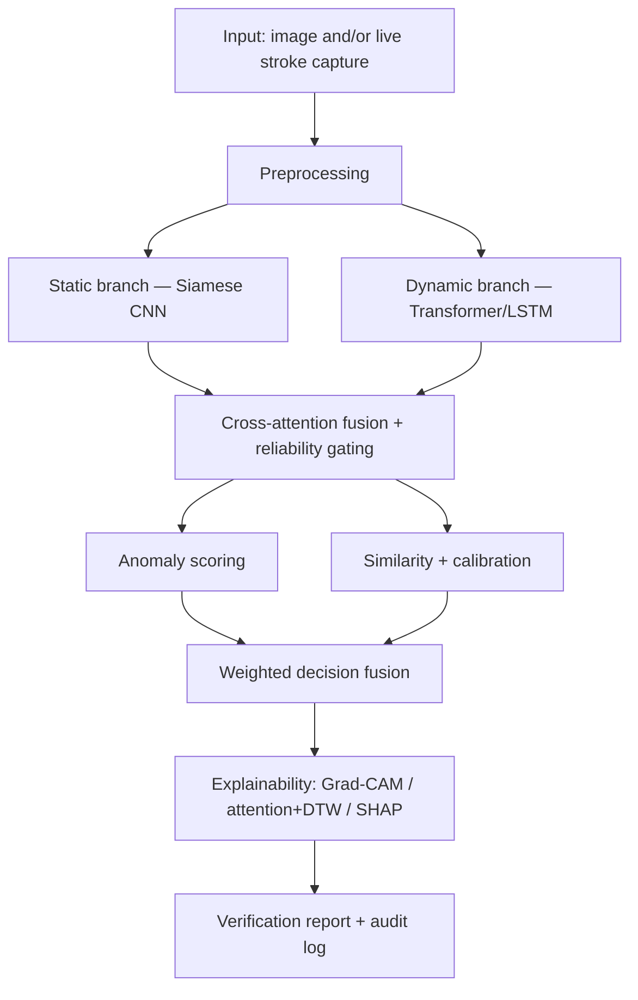

Full diagrams (both the conceptual pipeline and the model-to-module mapping) and
the design rationale for each choice: [`docs/architecture.md`](docs/architecture.md).

## The SIGNUM web console

A real-time verification console with a live signature pad (captures both the
rendered image *and* the raw pointer-event stroke sequence — x/y/pressure/tilt/time
— from a single signing action), a reference-enrollment panel, and a live HUD that
walks through each pipeline stage as a request is processed.

```bash
uvicorn api.app:app --reload
# open http://127.0.0.1:8000/
```

The console is a self-contained static site (`web/` — vanilla HTML/CSS/JS, no build
step) served by the same FastAPI app that exposes the API under `/api/*`
(`/api/verify`, `/api/health`, `/api/audit/verify_chain`). Its visual design — the
color system, HUD/telemetry layout, and gauge components in
[`web/css/theme.css`](web/css/theme.css) — is original work and a candidate
starting point if you pursue design protection for the interface; that's a legal
filing decision for you and, if you want it done properly, a patent attorney, not
something this repo does for you.

## Installation

```bash
python -m venv .venv
.venv\Scripts\activate            # Windows
# source .venv/bin/activate       # macOS/Linux

# CPU-only PyTorch (fastest to install; use the CUDA index for GPU training)
pip install torch torchvision --index-url https://download.pytorch.org/whl/cpu

pip install -e ".[dev]"
```

## Quickstart

**1. Generate a small synthetic dataset** (fastest way to smoke-test the whole
pipeline with zero downloads), or point the steps below at real data — see
[`data/README.md`](data/README.md) for two real, directly-downloadable datasets
(CEDAR, MOBISIG) and `scripts/prepare_real_datasets.py` to convert them:

```bash
python scripts/generate_demo_data.py --output data/processed/demo --num-writers 20
```

**2. Train each component** (in order — fusion and calibration depend on the branch
checkpoints):

```bash
python scripts/train_static.py  --manifest data/processed/demo/static_manifest.jsonl  --output checkpoints
python scripts/train_dynamic.py --manifest data/processed/demo/dynamic_manifest.jsonl --output checkpoints
python scripts/train_fusion.py  --static-manifest data/processed/demo/static_manifest.jsonl \
                                 --dynamic-manifest data/processed/demo/dynamic_manifest.jsonl \
                                 --checkpoints checkpoints
python scripts/fit_calibration.py --static-manifest data/processed/demo/static_manifest.jsonl \
                                   --dynamic-manifest data/processed/demo/dynamic_manifest.jsonl \
                                   --checkpoints checkpoints

# Optional: GAN forgery augmentation + closed-loop retraining
python scripts/train_gan.py --manifest data/processed/demo/static_manifest.jsonl --output checkpoints --synthesize 200
python scripts/evaluate.py  --static-manifest data/processed/demo/static_manifest.jsonl --checkpoints checkpoints
```

Training on a small/medium real dataset that fits in RAM? Add `--cache-in-memory`
to `train_static.py` — it preprocesses each image once instead of re-denoising it
every epoch (a large speedup; see [`docs/results.md`](docs/results.md) for why this
exists).

**3. Run a verification and get a report:**

```bash
python scripts/run_inference.py \
  --reference path/to/reference_signature.png \
  --query path/to/query_signature.png \
  --reference-stroke path/to/reference_stroke.json \
  --query-stroke path/to/query_stroke.json \
  --user-id writer_003 \
  --checkpoints checkpoints \
  --output reports/case_001
```

Produces `reports/case_001.pdf` (forensic report with Grad-CAM heatmap, confidence
interval, modality contribution split) and `reports/case_001.json`.

**4. Or serve it over HTTP / the web console:**

```bash
uvicorn api.app:app --reload
curl -X POST http://127.0.0.1:8000/api/verify \
  -F "reference_image=@reference.png" -F "query_image=@query.png"
```

## Notebooks — train and test on real data

`notebooks/` trains and evaluates on two **real, publicly downloaded** signature
datasets (no Kaggle auth or gated request form needed — see
[`data/README.md`](data/README.md)):

| Notebook | What it does | Data |
|---|---|---|
| [`01_dataset_exploration.ipynb`](notebooks/01_dataset_exploration.ipynb) | Loads both datasets, visualizes genuine-vs-forged pairs, runs the real preprocessing pipeline, and a full EDA (per-writer sample balance, class balance, image/stroke size distributions) | CEDAR + MOBISIG |
| [`02_train_static_branch.ipynb`](notebooks/02_train_static_branch.ipynb) | Trains the Siamese CNN, plots loss/EER/AUC, PCA of the embedding space, Grad-CAM | CEDAR (static) |
| [`03_train_dynamic_branch.ipynb`](notebooks/03_train_dynamic_branch.ipynb) | Trains the Transformer stroke encoder, attention-weight + DTW-deviation visualizations | MOBISIG (dynamic) |
| [`04_fusion_and_evaluation.ipynb`](notebooks/04_fusion_and_evaluation.ipynb) | Re-confirms held-out test EER/AUC for both branches, trains the fusion layer, runs the full end-to-end pipeline | CEDAR + MOBISIG + synthetic bridge |
| [`05_high_accuracy_training_and_evaluation.ipynb`](notebooks/05_high_accuracy_training_and_evaluation.ipynb) | Larger writer count + more epochs; reports skilled-forgery vs. random-forgery accuracy **separately** | CEDAR (static) |
| [`06_marl_decision_fusion.ipynb`](notebooks/06_marl_decision_fusion.ipynb) | Cooperative multi-agent RL (simplified MADDPG: decentralized actors, centralized critic) learns to combine the two branches' votes; compared honestly against a fixed-weight baseline | CEDAR + MOBISIG (real branch outputs) |

Run them in order — 03 depends on nothing from 02, but 04/05/06 load checkpoints
from `notebooks/artifacts/` or `checkpoints_real_v2/`. Notebooks 01-04 are
deliberately scaled down (a handful of writers, a few epochs, a lighter backbone)
so they finish in minutes on a CPU-only machine; 05 trains longer for a more
meaningful number, and 06 uses the full-scale `checkpoints_real_v2` branches. See
each notebook's first cell for exactly what's reduced and how to scale back up.
**On fusion**: CEDAR and MOBISIG are two independent datasets with no writer
overlap and no shared physical signing events, so notebooks 04 and 06 both bridge
this with paired/bootstrap-paired synthetic or label-matched sampling — see their
markdown cells for the full reasoning in each case.

```bash
pip install jupyter nbclient ipykernel
python -m ipykernel install --user --name sigverify-venv --display-name "Python 3 (sigverify)"
jupyter lab notebooks/
```

### From the notebooks (real data, real runs)

| CEDAR: genuine vs. skilled forgery | Preprocessing: raw scan → normalized |
|---|---|
| 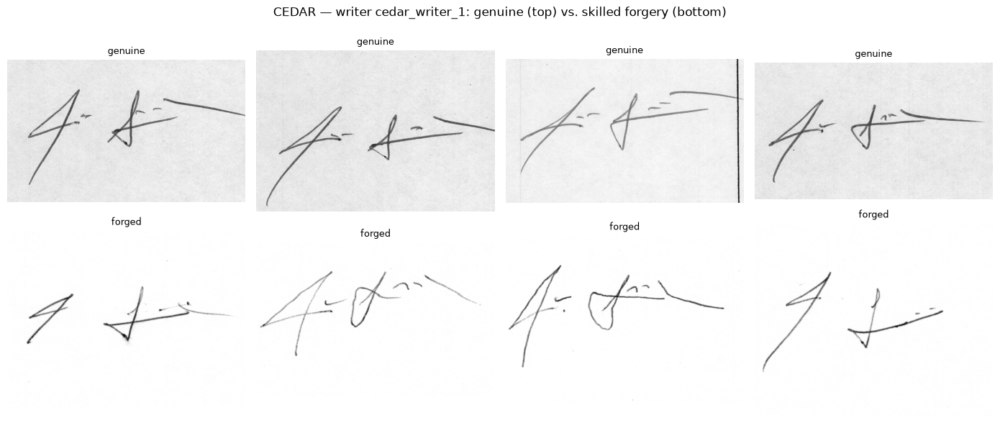 | 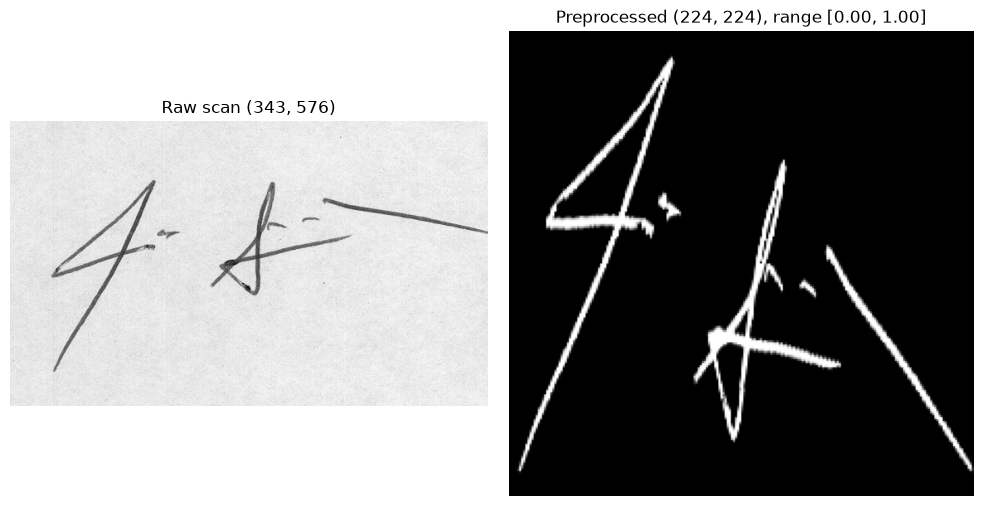 |

| MOBISIG: genuine vs. forged stroke trajectory | Stroke resampling + normalization |
|---|---|
| 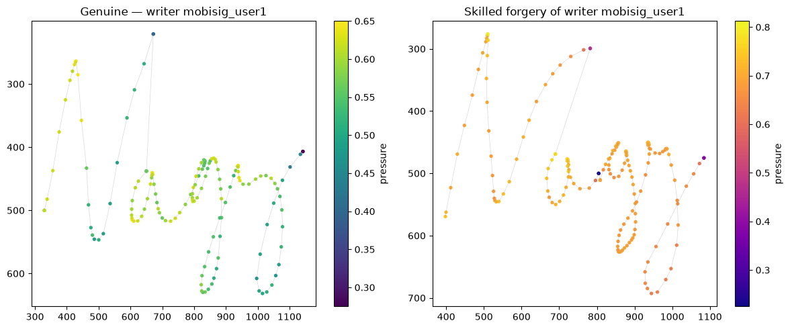 | 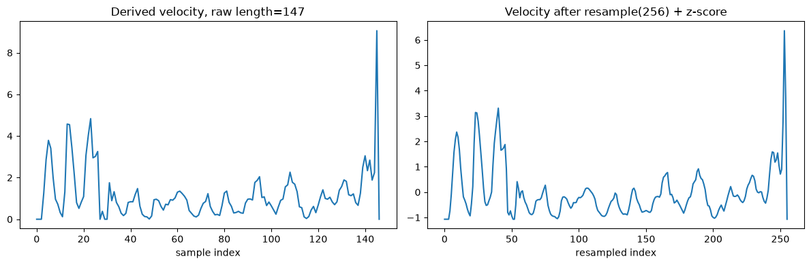 |

| Static branch training (real CEDAR) | Embedding space (PCA) | Grad-CAM |
|---|---|---|
| 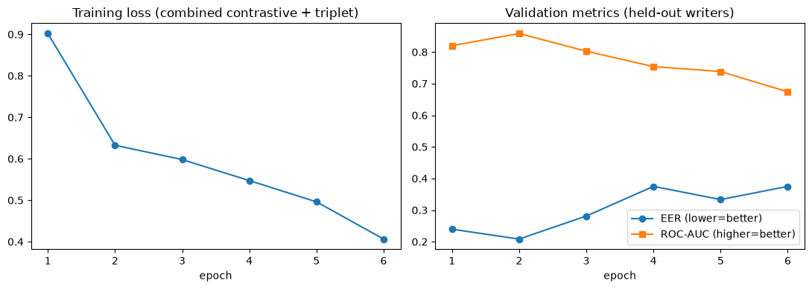 | 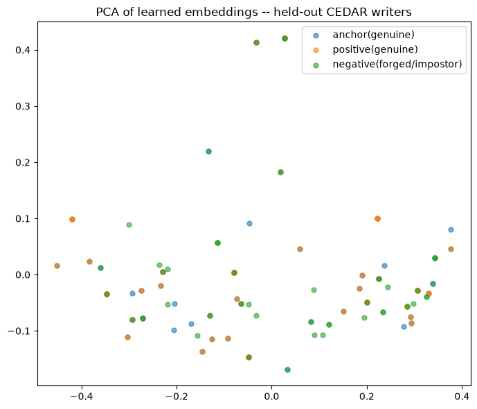 | 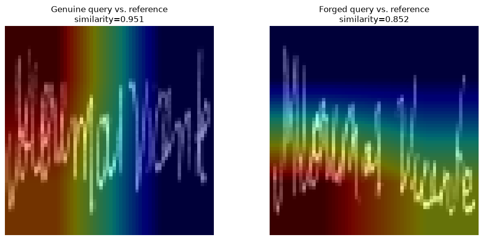 |

| Dynamic branch training (real MOBISIG) | Attention weights | DTW stroke deviation |
|---|---|---|
| 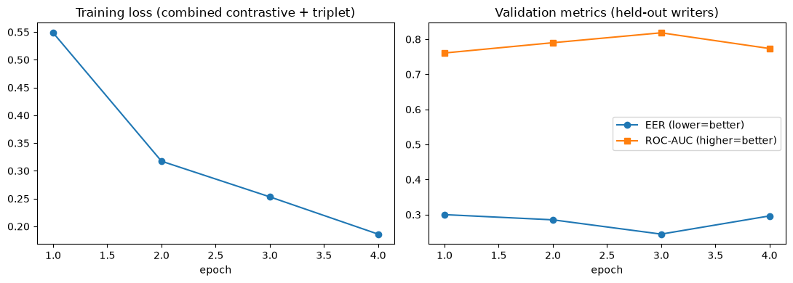 | 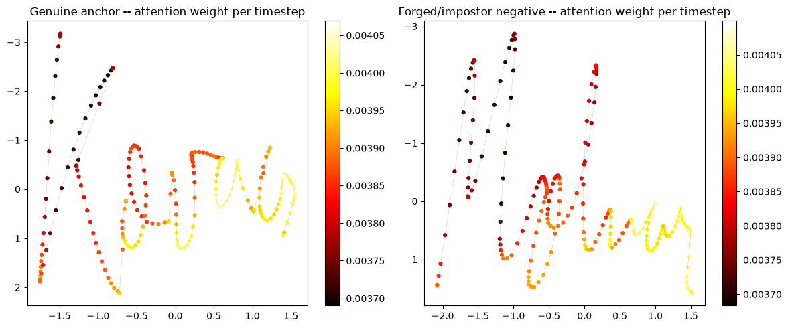 | 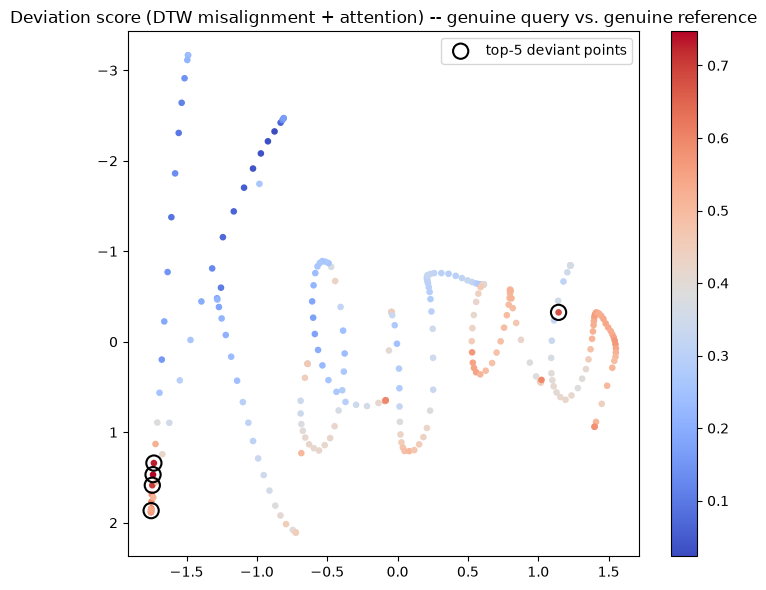 |

## Results

Full methodology, every number, and what it would take to get a production-scale
number: **[`docs/results.md`](docs/results.md)**. It now also includes an
exploratory data analysis of both datasets (per-writer sample balance, class
balance, image/stroke size distributions — `notebooks/01_dataset_exploration.ipynb`),
confusion matrices and full evaluation metrics (precision/recall/specificity/F1/
FAR/FRR) for every cross-validated model, and a single **performance-comparison
table listing every model trained in this repository** side by side, at the very
end of the page. Short version: the quick-demo notebooks (5-8 writers, a few
epochs) exist to prove the pipeline trains correctly on real data, not to claim
accuracy — one of them visibly misclassifies a held-out skilled forgery, which is
*exactly* what an intentionally under-trained checkpoint should do.
`05_high_accuracy_training_and_evaluation.ipynb` trains further and reports
skilled-forgery and random-forgery accuracy as two separate, clearly labeled
numbers rather than one blended figure.

### Live-product checkpoints (`checkpoints_real/`)

Produced by the actual training scripts (`scripts/train_static.py --cache-in-memory`,
`train_dynamic.py`), not the illustrative notebook loops — real numbers, writer-disjoint
validation split, on real CEDAR/MOBISIG data:

| Component | Writers | Val EER (mixed) | Val AUC (mixed) | Val accuracy @ EER |
|---|---|---|---|---|
| Static branch (CEDAR) | 25 | 0.221 | 0.866 | **77.9%** |
| Dynamic branch (MOBISIG) | 20 | 0.161 | 0.892 | **83.9%** |

A follow-up experiment retrained both branches on the **full** dataset (55/83
writers) plus data augmentation, specifically to push accuracy further — the
honest result was 73.3%/80.1%, *not* an improvement (early stopping cut both
runs short before augmentation's benefit could pay off; see
[`docs/results.md`](docs/results.md#v2-full-dataset--data-augmentation--a-real-experiment-an-honest-result)
for the full writeup and ROC curves). The 25/20-writer checkpoints above remain
what the live console serves. **No run in this repository has reached 99.5%
accuracy on skilled-forgery detection** — see `docs/results.md` for why that bar
is far above what small-scale CPU training on these datasets can realistically
produce, and what published literature actually reports.

A third experiment, `06_marl_decision_fusion.ipynb`, tried replacing the
supervised fusion layer with two cooperative RL agents (simplified MADDPG) that
each see only one branch's similarity score. Reported honestly: it **did not**
beat a plain fixed-weight (0.5/0.5) baseline — EER 0.2505 vs. 0.1840, accuracy
76.4% vs. 81.6% — a legitimate negative result the notebook discusses in detail
rather than hides. `CrossAttentionGatedFusion` remains the production fusion
approach.

### Cross-validation and hybrid-architecture comparison

Single train/val splits have real variance at these writer counts, so
`scripts/cross_validate.py` runs writer-disjoint **5-fold cross-validation**
(every writer held out exactly once) and reports mean ± std, a pooled
confusion matrix, and full precision/recall/specificity/F1/FAR/FRR — while
doubling as a paired head-to-head test of new hybrid architectures (CNN
feature map → Transformer self-attention for the static branch; BiLSTM →
Transformer for the dynamic branch) against the pre-existing baselines, on
identical folds:

| Branch | Variant | Mean EER | Mean AUC | Mean Acc. @ EER |
|---|---|---|---|---|
| Static (CEDAR) | CNN (baseline) | 0.2583 ± 0.0261 | 0.8039 ± 0.0361 | **74.17%** ± 2.61 |
| Static (CEDAR) | Hybrid CNN+Transformer | 0.2792 ± 0.0288 | 0.7797 ± 0.0330 | 72.08% ± 2.88 |
| Dynamic (MOBISIG) | Transformer (baseline) | 0.2461 ± 0.0371 | 0.8291 ± 0.0446 | 75.39% ± 3.71 |
| Dynamic (MOBISIG) | Hybrid BiLSTM+Transformer | 0.2294 ± 0.0446 | 0.8338 ± 0.0399 | **77.06%** ± 4.46 |

Honest reading: the hybrid **did not** beat the baseline on the static branch
(consistently worse across all three metrics), but **did** beat it — modestly
— on the dynamic branch. Full confusion matrices, per-branch reasoning for
why the two results differ, and the research context behind trying a hybrid
architecture at all: [`docs/results.md`](docs/results.md#writer-disjoint-k-fold-cross-validation-and-hybrid-architecture-comparison)
and [`docs/research_gap.md`](docs/research_gap.md).

### Performance & resource metrics

| Component | Config | Parameters | Checkpoint size |
|---|---|---|---|
| Static branch | ResNet50 / 224px | 24.7M | ~99 MB |
| Static branch | MobileNetV3-L / 64-128px (CPU-friendly) | 3.5M | 14.3 MB |
| Dynamic branch | Transformer, hidden=256, 3 layers | 2.7M | ~11 MB |
| Dynamic branch | Transformer, hidden=128, 2 layers (CPU-friendly) | 0.48M | 2.5 MB |
| Fusion | Cross-attention gated, 256-dim | 0.66M | 0.67 MB |

| Request (CPU-only, lightweight config) | Mean latency |
|---|---|
| Static image only | 1.40 s |
| Static + dynamic (stroke) | 1.47 s |
| Static + dynamic + full explainability | 1.76 s |

Full breakdown (including *why* `--cache-in-memory` exists — denoising a real scan
costs more than the entire forward+backward pass) in
[`docs/results.md`](docs/results.md#performance--resource-metrics).

## Research / patent-support documentation

[`docs/technical_disclosure.md`](docs/technical_disclosure.md) describes the
system's candidate points of novelty (the reliability-gated fusion mechanism, the
closed-loop adversarial forgery augmentation, the dual-signal explainability
scoring, the hybrid CNN-Transformer / BiLSTM-Transformer embedding heads, and
others) as a starting point for a patent attorney or a research paper's methods
section. It is **not** a patent application and doesn't claim to be
"patent-ready" — that determination requires an actual attorney and a prior-art
search this repo hasn't done.

[`docs/research_gap.md`](docs/research_gap.md) records what this project checked
against current (2024-2026) published literature: the closest comparable
hybrid CNN-Transformer papers (HTCSigNet, TransOSV, SignatureGuard) and what
they actually report, the specific gaps in the field this project's design
responds to (writer-dependent evaluation inflating accuracy, unreported
cross-validation variance, under-explored multi-modal fusion), and a documented
account of which additional public datasets were investigated and why they
weren't added (SVC2004's only open mirror is in an incompatible feature format;
GPDS/BHSig260 remain license-gated).

## Project layout

```
├── api/                  # FastAPI service (mounts web/ + exposes /api/*)
├── configs/              # default.yaml (full-scale) + lightweight_real.yaml (CPU demo scale)
├── data/                 # dataset docs; raw/processed data is git-ignored
├── docs/
│   ├── architecture.md          # pipeline diagrams + design rationale
│   ├── results.md                # every measured number, methodology, honest caveats
│   ├── technical_disclosure.md   # research/patent-support technical description
│   ├── research_gap.md           # literature check, identified gap, dataset-access findings
│   └── images/                   # plots extracted from the executed notebooks
├── notebooks/            # 01-05: train + test on real CEDAR/MOBISIG data
├── scripts/              # train_*.py, fit_calibration.py, evaluate.py, run_inference.py,
│                         # prepare_real_datasets.py, generate_demo_data.py
├── src/sigverify/
│   ├── preprocessing/    # image + stroke preprocessing
│   ├── localization/     # YOLOv8 signature-region detector
│   ├── models/           # static/dynamic branches, fusion, GAN, anomaly, calibration, losses
│   ├── explainability/   # Grad-CAM, attention/DTW deviation, SHAP
│   ├── data/             # manifest-driven datasets + synthetic demo generator
│   ├── pipeline/         # end-to-end inference + report generation
│   └── audit/            # hash-chained audit ledger
├── tests/                # pytest suite (preprocessing, models, pipeline, audit, metrics)
└── web/                  # SIGNUM console — vanilla HTML/CSS/JS, no build step
```

## Testing

```bash
pytest                        # unit + integration tests (CPU, ~30s)
ruff check src scripts api tests
```

## License

Apache License 2.0 — see [LICENSE](LICENSE) and [NOTICE](NOTICE).
