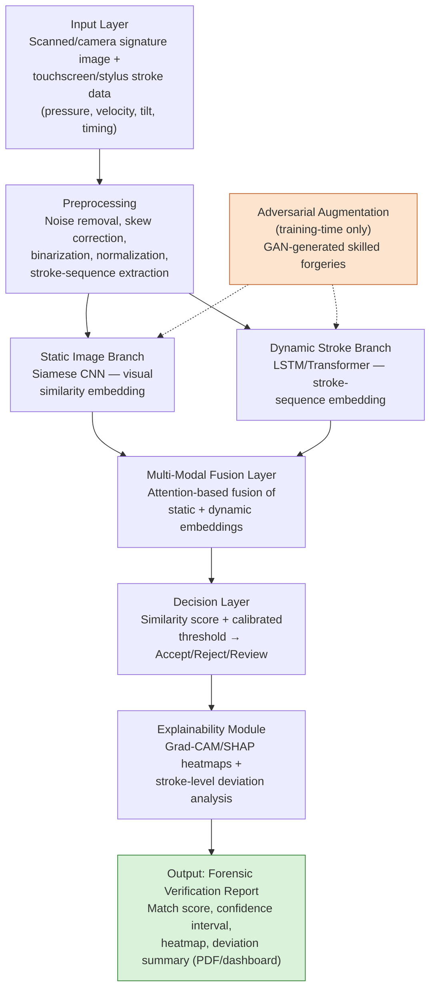
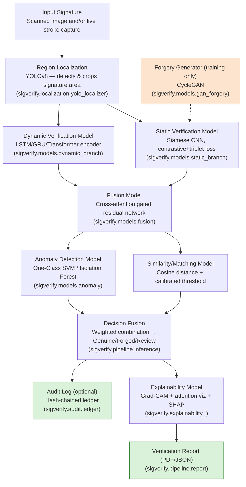

# System Architecture

Two views of the same pipeline: the conceptual data-flow (what happens to a
signature as it moves through the system) and the concrete model-to-module mapping
(what algorithm implements each stage, and where it lives in `src/sigverify/`).

## 1. Conceptual pipeline



## 2. Model pipeline (implementation mapping)



## Module → algorithm → literature-gap mapping

| Module | Algorithm(s) | Purpose | Code |
|---|---|---|---|
| Signature Region Localization | YOLOv8 | Detects/crops the signature region from scanned forms | `localization/yolo_localizer.py` |
| Static Image Verification | Siamese CNN, contrastive+triplet loss | Visual similarity embedding | `models/static_branch.py`, `models/losses.py` |
| Dynamic Signature Analysis | LSTM / GRU / Transformer encoder | Stroke-sequence (pressure/velocity/tilt) embedding | `models/dynamic_branch.py` |
| Multi-Modal Fusion | Cross-attention + gated residual, reliability gating | Combines static+dynamic embeddings (**Gap A**) | `models/fusion.py` |
| Forgery Data Augmentation | CycleGAN, closed-loop retraining | Synthesizes skilled forgeries, retargets verifier failure cases (**Gap C**) | `models/gan_forgery.py` |
| Explainability | Grad-CAM, attention-weight visualization, SHAP | Heatmaps, stroke-level deviation, modality-contribution split (**Gap B**) | `explainability/*.py` |
| Anomaly Scoring | One-Class SVM / Isolation Forest | Out-of-distribution / novelty check | `models/anomaly.py` |
| Decision Calibration | Platt scaling / Score-based Likelihood Ratio | Forensic-grade calibrated evidentiary metric (**Gap E**) | `models/calibration.py` |
| Tamper-Proof Logging (optional) | Hash-chained ledger | Auditable decision/template-update trail (**Gap F**) | `audit/ledger.py` |

## Decision fusion formula

The final `combined_score` (see `pipeline/inference.py::_combine_decision`) is a
weighted combination of the calibrated fused similarity, the two raw per-modality
similarities, and the anomaly score:

```
combined_score = 0.5 * calibrated_fused_similarity
                + 0.2 * static_similarity
                + 0.2 * dynamic_similarity      (dropped + renormalized if unavailable)
                + 0.1 * anomaly_score            (dropped + renormalized if unavailable)
```

Thresholds (`configs/default.yaml -> decision`):

| combined_score | Decision |
|---|---|
| ≥ `accept_threshold` (0.80) | **Genuine** |
| `review_lower_bound` (0.55) – `accept_threshold` | **Review** |
| < `review_lower_bound` | **Forged** |

## Why these choices

- **Siamese CNN over a plain classifier** — signature verification is inherently
  open-set (new writers enroll continuously); a similarity embedding generalizes to
  unseen writers without retraining a classifier head.
- **Transformer *and* LSTM/GRU as interchangeable dynamic encoders** — the
  Transformer captures long-range stroke dependencies well with enough data; the
  bidirectional LSTM/GRU path is kept as a lighter-weight, faster-to-converge
  fallback for smaller enrolled-writer datasets (swap via `dynamic_branch.encoder` in
  the config).
- **Cross-attention + reliability gating in fusion, not simple concatenation** — real
  captures are frequently missing a modality (scanned-only signatures have no stroke
  data) or have a degraded one (shaky stylus capture); gating lets the fused
  embedding down-weight the unreliable/absent modality instead of being corrupted by
  it.
- **SHAP on the decision-fusion function, not the raw CNN** — attributing pixel-space
  SHAP values on a deep CNN is expensive and, for a verification report, less
  actionable than "how much did static vs. dynamic vs. anomaly scoring drive this
  call." Explaining the small (4-input) fusion function directly answers that.
- **EER/AUC as the primary offline metrics** — these are the metrics every public
  signature-verification benchmark (CEDAR, GPDS, ICDAR, SVC2004, MOBISIG, DeepSignDB)
  reports, so results here are directly comparable to published baselines.
