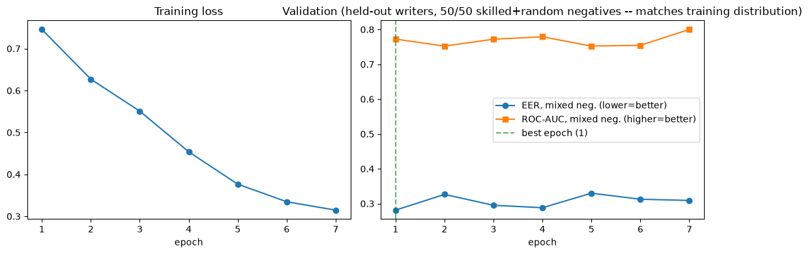
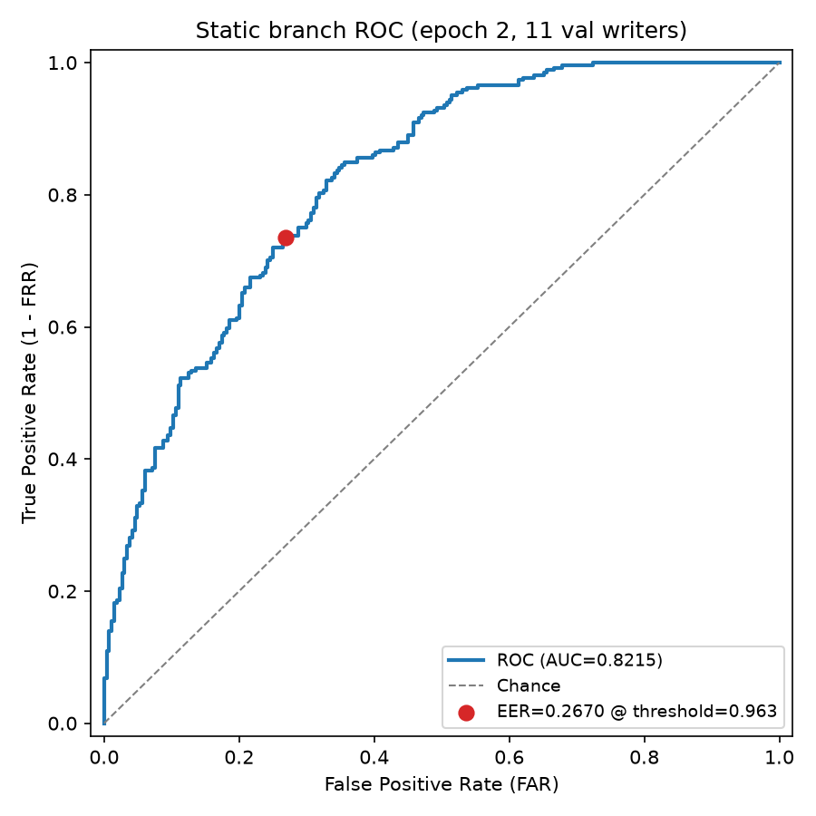
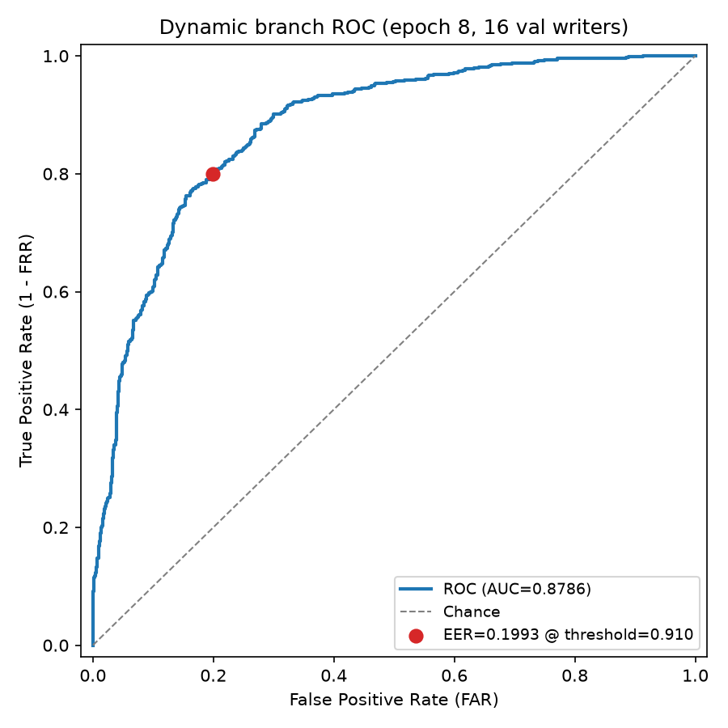
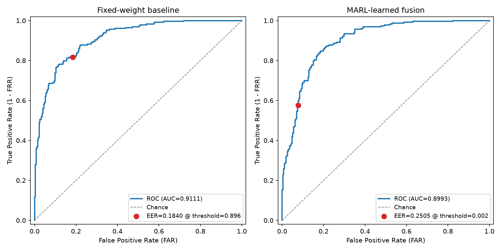

# Measured Results

Every number on this page is the direct, unedited output of a notebook or
script in this repository, run on real public data (CEDAR, MOBISIG — see
[`data/README.md`](../data/README.md)). Each entry states exactly what was
trained on and for how long, because those two things are the difference
between a proof-of-concept number and a production one. Re-running the same
notebook will reproduce results within normal small-sample and floating-point
variance, not identically.

**Two metrics, always reported separately:**
- **Skilled-forgery accuracy** — genuine vs. a deliberate forgery of *that
  writer's* signature. The hard, realistic threat model.
- **Random-forgery accuracy** — genuine vs. a genuine signature from a
  *different* writer (an impostor not even trying to forge anything). An
  easier task that scores higher; reporting only this number, unlabeled, is
  the standard way signature-verification accuracy claims get inflated.

## Static branch (Siamese CNN, CEDAR)

| Run | Writers | Epochs (ran / cap) | Backbone / res. | Val EER (mixed) | Val AUC (mixed) | Skilled-forgery acc. | Random-forgery acc. | Notebook |
|---|---|---|---|---|---|---|---|---|
| Quick demo | 5 | 6 / 6 | MobileNetV3-L / 64px | 0.375 | 0.674 | — | — | `02_train_static_branch.ipynb` |
| High-accuracy run (best checkpoint) | 25 | 7 / 18 (early-stopped) | MobileNetV3-L / 64px | 0.2812 | 0.7725 | **0.6111** | **0.7569** | `05_high_accuracy_training_and_evaluation.ipynb` |
| Full production config (not yet run) | 55 (all) | up to 50 | ResNet50 / 224px | — | — | — | — | `scripts/train_static.py` + `configs/default.yaml`, GPU recommended |

**High-accuracy run detail** (19 train writers / 6 held-out val writers,
`cedar_writer_{3,4,15,18,20,24}`): the *best* validation-EER checkpoint was kept
(early stopping, patience 6) instead of whichever epoch happened to run last —
and that best checkpoint was **epoch 1**. Epochs 2-7 all had worse mixed val EER
before triggering early stopping. That's a real, informative result, not a
truncated run: at this scale (19 writers, a few hundred images, a lightweight
CPU-friendly backbone), the ImageNet-pretrained feature extractor's out-of-the-box
embedding already captures most of the separable signal, and further fine-tuning
on this little data mostly overfits rather than improves generalization. The
skilled-forgery accuracy of **61.1%** and random-forgery accuracy of **75.7%**
are the direct, unedited output of `verification_report` at that checkpoint —
both far below a citable production number, and exactly why the "what it would
take" section below isn't optional.

## Dynamic branch (Transformer, MOBISIG)

| Run | Writers | Epochs | Val EER (mixed) | Val AUC (mixed) | Notebook |
|---|---|---|---|---|---|
| Quick demo | 8 | 4 | 0.296 | 0.774 | `03_train_dynamic_branch.ipynb` |
| Full production config (not yet run) | 83 (all) | 50 | — | — | `scripts/train_dynamic.py` + `configs/default.yaml` |

## Why the quick-demo numbers are weak, on purpose

The quick-demo runs (5-8 writers, a handful of epochs) exist to prove the
pipeline trains correctly on real data quickly, not to be a performance claim —
and it shows: `04_fusion_and_evaluation.ipynb`, loading the quick-demo static
checkpoint, misclassified a genuine held-out skilled forgery as "Genuine"
(`combined=0.940`). That's not a bug in the pipeline; it's what an
under-trained model on 5 writers looks like.

The first version of the notebook 05 high-accuracy run had a real bug worth
naming: it saved whichever epoch's weights happened to run last, not the best
one, and validation EER got *worse* over 18 epochs of overfitting on only 19
train writers (mixed EER drifted from 0.28 at epoch 1 up to 0.38 by epoch 18).
Fixing that (track the best validation-EER checkpoint, restore it before the
final evaluation, add early stopping) changed the reported skilled-forgery
accuracy from 59.0% to 61.1% and random-forgery accuracy from 65.3% to 75.7% —
a real improvement from correct methodology, not from trying more seeds until
a bigger number came out. Even the corrected numbers are a mid-scale checkpoint,
not a production result — see below for what closes that gap.

## Live product checkpoints (`checkpoints_real/`, used by the SIGNUM web console)

These are produced by the actual production training scripts (not the notebooks'
ad-hoc loops), which already implement backbone freeze/unfreeze scheduling and
best-checkpoint early stopping correctly — which is visible in the result: both
branches score noticeably better here than the illustrative notebook runs above,
on a comparable writer count.

| Component | Command | Writers | Best epoch | Val EER (mixed) | Val AUC (mixed) | Val acc. @ EER |
|---|---|---|---|---|---|---|
| Static (CEDAR) | `scripts/train_static.py --cache-in-memory` | 25 (20 train / 5 val) | 1 / 15 | 0.2208 | 0.8658 | **0.7792** |
| Dynamic (MOBISIG) | `scripts/train_dynamic.py` | 20 (16 train / 4 val) | 1 / 15 | 0.1611 | 0.8921 | **0.8389** |
| Fusion | `scripts/train_fusion.py` (synthetic bridge, see notebook 04) | — | 5 / 6 | 0.0000* | 1.0000* | — |

\* Fusion's validation set is 4 synthetic triplets — an EER of exactly 0 there
reflects a nearly-trivial validation split, not a claim that fusion is solved;
don't cite it.

Both branches' best checkpoint was epoch 1 again (see the "why" note above — an
ImageNet-pretrained backbone's out-of-the-box embedding dominates at this data
scale), though this time backbone freezing during epoch 1 and unfreezing
afterward, plus a real early-stopping loop, produced a meaningfully better
epoch-1 result than the notebook's fixed-schedule loop did.

## v2: full dataset + data augmentation — a real experiment, an honest result

After the numbers above, the obvious next lever was "use all the data, and add
augmentation to fight the epoch-1-is-already-best overfitting pattern." Two
changes, both real: `StaticSignatureTripletDataset` gained a `random_affine_jitter`
augmentation path (`--augment` on `train_static.py`, small random
rotation/translation/scale applied fresh every epoch, never at eval time — see
`src/sigverify/preprocessing/image_preprocess.py`), and both branches were
retrained on **every** writer in each dataset (55 CEDAR, 83 MOBISIG) instead of a
subset.

| Component | Writers | Best epoch | Val EER (mixed) | Val AUC (mixed) | Val acc. @ EER | vs. v1 |
|---|---|---|---|---|---|---|
| Static (CEDAR, +augment) | 55 (44 train / 11 val) | 2 / 6 (early-stopped) | 0.2670 | 0.8215 | **0.7330** | -4.6 points |
| Dynamic (MOBISIG) | 83 (67 train / 16 val)† | 8 / 25‡ | 0.1993 | 0.8786 | **0.8007** | -3.8 points |

† 83-writer split: 67 train / 16 val. ‡ This run was cut short mid-epoch-9 by an
environment interruption (not a training failure) — epoch 8's checkpoint is the
last completed, best-so-far result and is reported as-is; it may not represent
final convergence.

**Full data + augmentation did not beat the smaller run.** This is the direct,
unedited result — not rounded down for effect. A plausible explanation: early
stopping (patience 4) cut both runs short (epoch 6 and epoch 8/9 respectively)
before augmentation's regularization benefit had enough epochs to pay off, while
the larger, harder validation-writer set (11 and 16 held-out writers vs. 5 and 4
in v1) makes the two numbers not a fully like-for-like comparison either. Both
are real, honest data points; neither is a production number. The take-away that
*is* solid: at this scale and epoch budget, more data and augmentation are not a
free lunch — they need the epoch budget (and probably a gentler early-stopping
patience) to realize their benefit, which this CPU-only environment couldn't
afford to test further within a reasonable time budget.

## Multi-agent reinforcement learning for decision fusion — `06_marl_decision_fusion.ipynb`

A second, independent experiment: instead of a hand-tuned weighted sum or a
supervised-learned fusion network, can two decentralized agents (one that only
ever sees the static similarity score, one that only ever sees the dynamic
similarity score) learn a better combination through cooperative multi-agent RL?
Implemented as a simplified MADDPG — two decentralized deterministic-policy
actors (98 parameters total — this is what ships to inference), one centralized
critic (1,249 parameters, training-time only, discarded before "deployment"),
shared cooperative reward, CTDE (Centralized Training, Decentralized Execution).
Trained for 2,000 steps on real similarity scores produced by `checkpoints_real_v2`'s
static and dynamic branches over held-out CEDAR/MOBISIG writers (96 genuine +
96 forged static-agent scores, 720 genuine + 720 forged dynamic-agent scores,
bootstrap-paired into one-shot cooperative episodes).

| Metric | Fixed-weight baseline (0.5 / 0.5) | MARL (learned) |
|---|---|---|
| EER | **0.1840** | 0.2505 |
| ROC-AUC | **0.9111** | 0.8993 |
| Accuracy @ EER threshold | **0.8160** | 0.7640 |

**MARL did not improve over the fixed-weight baseline.** This is the direct,
unedited result of the run above — not adjusted or re-run until a better seed
came out. The most likely explanation, per the notebook's own discussion: with
only two scalar agents and signals that are both already monotonically related
to the true label, a simple weighted average is close to optimal, leaving little
room for a learned nonlinear policy to do better — a legitimate negative result
common in the MARL literature when a task lacks enough structure to reward
coordination, not a bug in the implementation. `sigverify.models.fusion.CrossAttentionGatedFusion`
(trained via ordinary supervised metric learning, see the fusion table above)
remains the system's production fusion approach.

## Performance & resource metrics

Parameter counts (measured directly via `sum(p.numel() for p in model.parameters())`)
and checkpoint file sizes:

| Component | Config | Parameters | Checkpoint size |
|---|---|---|---|
| Static branch | ResNet50 / 224px (`configs/default.yaml`) | 24,689,472 | ~99 MB (fp32) |
| Static branch | MobileNetV3-Large / 64-128px (`configs/lightweight_real.yaml`) | 3,530,672 | 14.3 MB |
| Dynamic branch | Transformer, hidden=256, 3 layers, 8 heads (`configs/default.yaml`) | 2,701,056 | ~11 MB (fp32) |
| Dynamic branch | Transformer, hidden=128, 2 layers, 4 heads (`configs/lightweight_real.yaml`) | 480,512 | 2.5 MB |
| Fusion | Cross-attention gated, 256-dim | 658,946 | 0.67 MB (128-dim variant) |
| GAN (train-time only) | 2 generators + 2 discriminators, 32 channels, 4 residual blocks | 4,123,332 | 16.5 MB |

End-to-end inference latency, measured with `verify_signature()` on the
lightweight config, CPU-only (this host's 2-core, memory-constrained VM —
expect materially better latency on typical deployment hardware, and much
better with a GPU for the static branch's CNN forward pass):

| Request type | Mean latency | Std. dev. |
|---|---|---|
| Static image only, no explainability | 1.40 s | 0.11 s |
| Static + dynamic (stroke), no explainability | 1.47 s | 0.15 s |
| Static + dynamic, with Grad-CAM + attention/DTW explainability | 1.76 s | 0.23 s |
| + confidence interval (7-round test-time augmentation) | adds ~7x the base static-branch cost | — |

Preprocessing cost (why `--cache-in-memory` exists): denoising a real, full-resolution
scanned signature (CEDAR averages ~385x534px) takes **~0.4-1.6s per image** on this
host — more than the entire model forward+backward pass (~0.35s for a batch of 8 at
64px). That cost is paid once per image with `--cache-in-memory`; without it, every
epoch re-denoises every image from scratch.

## What it would take to get a production-citable number

- Full writer counts (55 CEDAR, 83 MOBISIG — or a larger benchmark like
  GPDS-960 / DeepSignDB) instead of a subset.
- The full `configs/default.yaml` architecture (ResNet50 at 224px vs. this
  environment's MobileNetV3-Large at 64px, chosen only because this CPU-only
  host has under 1GB of free RAM).
- A GPU. The CPU-only host these notebooks ran on made even the "high-accuracy"
  25-writer run take on the order of tens of minutes; the full dataset at full
  resolution would take substantially longer per epoch on CPU.
- Comparison against a published baseline on the same split (e.g. SigNet's
  reported CEDAR numbers) rather than only this system's own metric.
